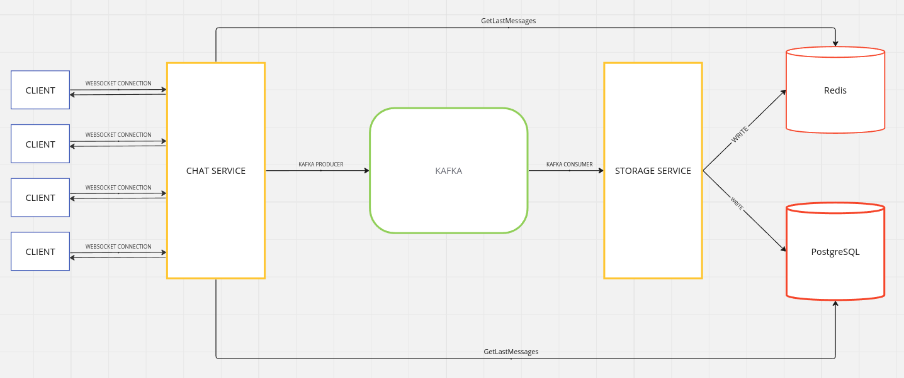

## 1. Запуск всех сервисов

```sh
docker compose up -d
```

## 2. Запуск клиента
Производится из директории `client`
```sh
go run cmd/main/main.go
```

Далее в консоли вводим никнейм и произойдет подключение клиента к серверу.

Можно запустить несколько клиентов


## Архитектура


