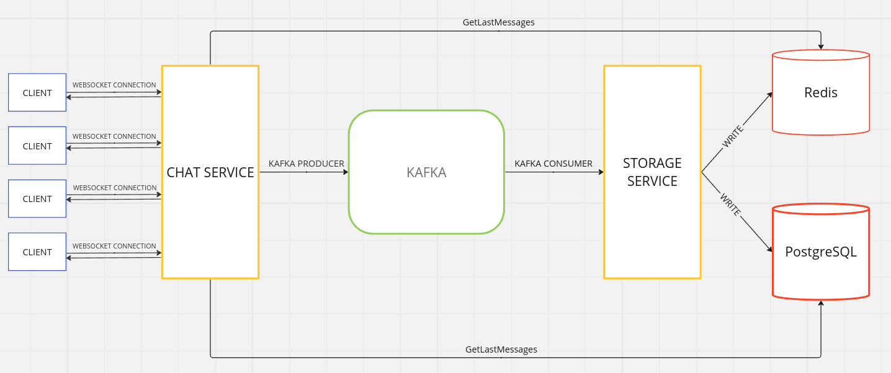
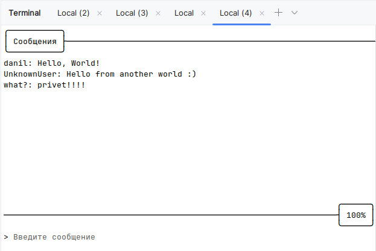

# websocket-chat

Содержит исходынй код проекта websocket чата

## Архитектура



### 1. Chat Service

`./services/chat`

Поддерживает websocket соединения с клиентами, сохраняет сообщения от клиентов в брокер Kafka
и рассылает их другим клиентам. Запускается на порту `:8080`.

При подключении нового клиента загружает последние N сообщений чата (переменная `MessagesToLoad` в `./chat/example.env`)
из БД и отправляет их клиенту. 
Изначально пытается загрузить сообщения из кэша Redis, в случае недоступности Redis загружает сообщения из Postgres

### 2. Kafka

Служит брокером между storage и chat сервисами, хранит в себе сообщения клиентов.
Запускается в связке с Zookeeper'ом

### 3. Storage Service

`./services/storage`

Читает сообщения из Kafka и сохраняет их в Postgres и Redis

### 4. Redis

Служит в качестве кэша для сохранения последних N сообщений

### 5. Postgres

Используется как персистентное хранилище всех сообщений

## Запуск проекта

### 1. Запуск всех сервисов

Производится из корня проекта
```sh
docker compose --env-file example.env up -d
```

### 2. Запуск клиента
Производится из директории `client`
```sh
go run cmd/main/main.go
```

Далее в консоли вводим никнейм и произойдет подключение клиента к серверу.

Можно запустить несколько клиентов, для выхода используется комбинация `^C`

## Пример работы

3 подключенных клиента


